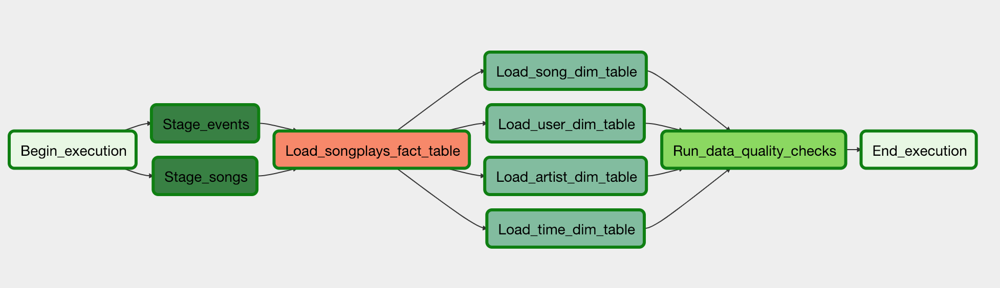

# Udacity_DataEngineering-Data-Pipeline-Airflow
Create and automate a data pipeline with Apache Airflow for a music streaming company

## The Data
Sparkify, a startup has launched a music streaming app. Their focus is to provide/host a collection of songs most widely streamed by users. And to do that, they need to find out just the kind of music that is in demand i.e. what are the kinds of songs people are listening to.
For doing so, they have 2 types of data :
1. The list of songs
2. The user logs from the devices which record all user activity.

### The data analysis goals
The data as mentioned above is in json format which is not friendly for analytics and is in different files.
The idea is to organise the data & put it together in such a way that it makes analytics and decision making easy.

## Implementation

### DB schema 
We use a star schema with one Fact table (the songplay table) and 4 Dimension tables (users, songs, artists, time)
1. The songplay_table will hold information about user sessions, the songs played along with duration and access device (timestamp, user id, level, song id, artist id, session id, user location and access device)
2. The users table will hold information about the users (user id, first name, last name, gender, and level (of subscription))
3. The songs table will hold information about the songs (song ID, song name (title), artist id, year & duration of song)
4. The artist table will hold information abou the artists (artist id, name, location, latitude and longitude)
5. The time table will hold information about all the times all users accessed the songs, with the timestamp saved along with hr, day, week, month, year format.

### ETL pipeline
The ETL pipeline is as follows:
1. Load all the data from events and song files into staging tables in Redshift.
2. Load data from staging tables into the fact and dimension tables (analytics tables)
3. Run Data Quality checks

## Creating the pipeline using Airflow
The dag is split into a number of tasks that are to be executed in order as shown below.

The main tasks are :
1. Begin
2. Load songs data into the staging_songs table on Amazon Redshift.
3. Load log data into the staging_events table on Amazon Redshift. There is an option to add timestamped log files selectively.
4. Use the staging tables, create the tables for users, artists, songs and time
5. Run Data Quality Checks for e.g to make sure required columns do not have null values

The tasks make use of user defined operators and helper functions to split the entire pipeline into easy to maintain modules

## Analysis of the data
The tables now be used to run queries for analysis for e.g.
1. The songplay tables can be queried to find the songs (sond_id) mostly played 
2. The songplay tables can be queried to find the level most users are in (free or paid)
3. The songplay and users tables can be queried to find information about males/females distribution.
4. The songplay and time tables can be queried to find day/week/month/year information to find patterns between songs played and day of the week/month etc

## Executing the scripts
The files to be executed are:
1. create_tables.sql on redshift
2. run the dag on airflow

